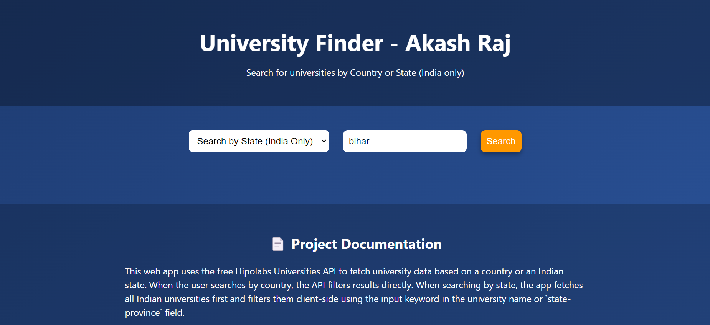

# 🎓 University Search Web App

This is a simple and elegant University Search web application built using **HTML, CSS, JavaScript, and Axios**. It uses the [Hipolabs Universities API](http://universities.hipolabs.com/) to search for universities by **country** or **state (India only)** and displays results in a beautiful animated table.

---

## 🌐 Live Preview

https://akashraj2106.github.io/india-university-directory/

---

## 📸 Screenshots



---

## 🚀 Features

- 🔎 Search universities by **country name** or **state name**
- 📃 Display university name and website
- 🖱️ Hover animation with **3D effects**
- 🎨 Fully responsive and modern UI
- ⚡ Fast API integration with Axios

---

## 🛠️ Tech Stack

- **HTML** – Structure
- **CSS** – Styling with 3D animation & responsiveness
- **JavaScript** – Functionality & event handling
- **Axios** – API calls to Hipolabs

---

## 🧪 How to Use

1. **Clone the repository:**

   ```bash
   git clone https://github.com/your-username/university-search-app.git
Navigate to the project folder:

bash
Copy
Edit
cd university-search-app
Open index.html in your browser
You can also use VS Code Live Server or deploy online.

📂 Project Structure
bash
Copy
Edit
university-search-app/
<br>
│
<br>
├── index.html  # Main HTML file
<br>
├── style.css  # Main css file
<br> 
├── script.js  # Main javascript file
<br>   
├── README.md    # Project description
<br>     
└── preview.png   # Screenshot (add one if needed)
<br>    
📡 API Used  Hipolabs Universities API


```bash
git add .
git commit -m "Added README"
git push origin main